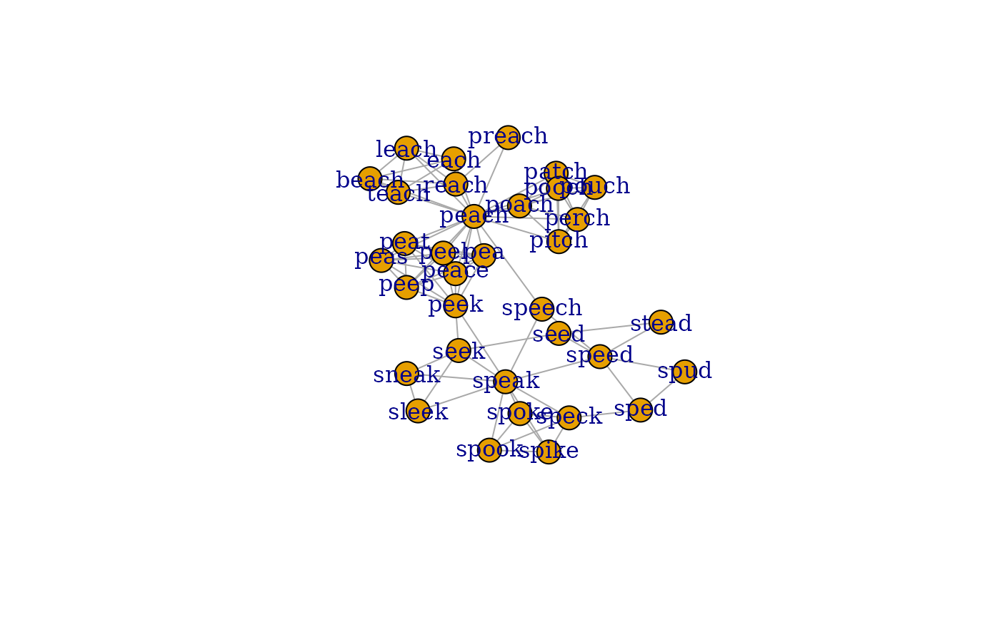
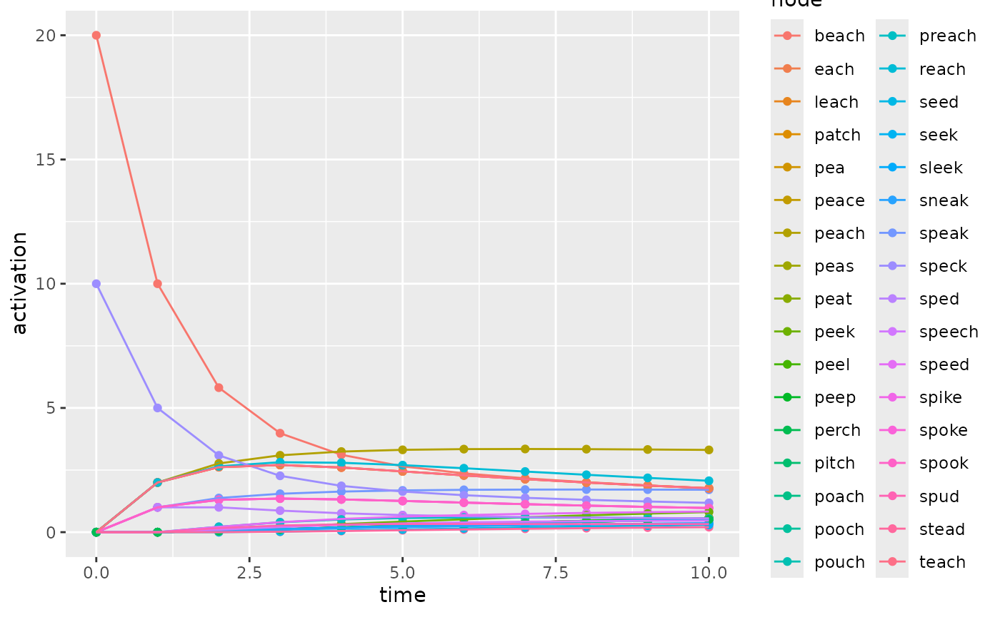
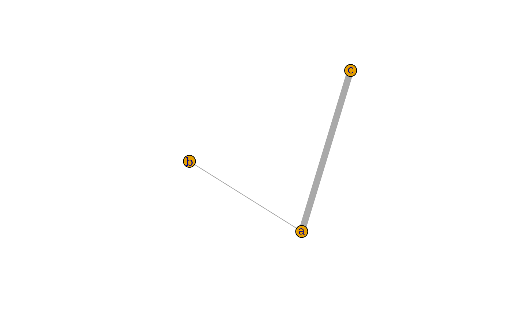
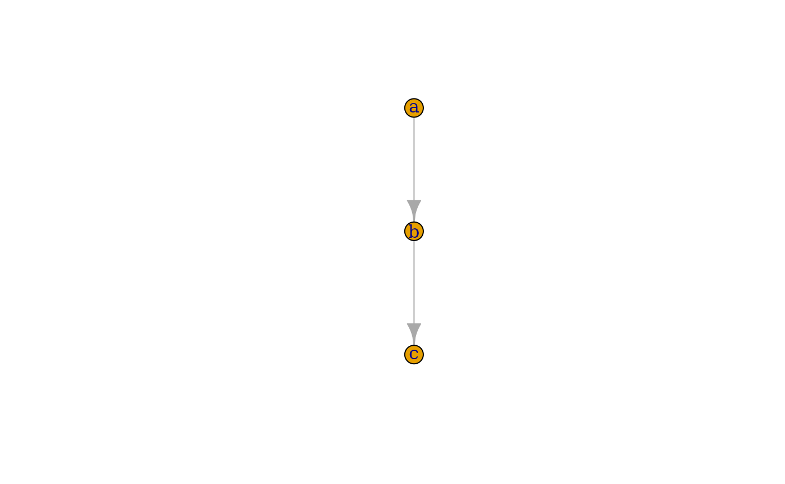

# spreadr: A R package to simulate spreading activation in a network

## Introduction

The notion of spreading activation is a prevalent metaphor in the
cognitive sciences; however, the tools to implement spreading activation
in a computational simulation are not as readily available. This
vignette introduces the spreadr R package (pronunced ‘SPREAD-er’), which
can implement spreading activation within a specified network structure.
The algorithmic method implemented in the `spreadr` function follows the
approach described in Vitevitch et al. (2011), who viewed activation as
a fixed cognitive resource that could “spread” among connected nodes in
a network.

## Installation

You can choose to install the stable version from CRAN, or the
development build from GitHub.

### Stable (CRAN)

``` r

install.packages("spreadr")
```

If you encounter any bugs or issues, please try the development build
first. The bug or issue may have already been fixed on GitHub, but not
yet propagated onto CRAN.

### Development (GitHub)

``` r

install.packages("remotes")
remotes::install_github("csqsiew/spreadr")
```

If you encounter any bugs or issues, please try the development build
first. The bug or issue may have already been fixed on GitHub, but not
yet propagated onto CRAN.

## Example with a phonological network

In this example, we will simulate spreading activation in a small sample
portion of a phonological network (Chan and Vitevitch 2009) which is
automatically loaded with spreadr. This phonological network is
unweighted and undirected, but spreadr supports weighted and directed
graphs as well. This makes it is possible to simulate spreading
activation in a weighted network where more activation is passed between
nodes that have “stronger” edges, or in a directed (asymmetric) network
where activation can pass from node *i* to node *j* but not necessarily
from node *j* to node *i*.

You may substitute any network in place of this example one.

### Describe the network

The network for spreading activation must be either an `igraph` object
or an adjacency matrix.

#### Using an igraph object

`pnet`, an `igraph` object with named vertices representing our sample
phonological network is automatically loaded with the spreadr library.

``` r

library(spreadr)
library(igraph)

data("pnet")  # load and inspect the igraph object
```

``` r

plot(pnet)
```

    ## This graph was created by an old(er) igraph version.
    ## ℹ Call `igraph::upgrade_graph()` on it to use with the current igraph version.
    ## For now we convert it on the fly...



Don’t worry if your plot does not look exactly as above. The layout of
the nodes is determined stochastically.

#### Using an adjacency matrix

`pnetm`, an named adjacency matrix representing our sample phonological
network is automatically loaded with the spreadr library.

``` r

library(spreadr)
library(igraph)
set.seed(1)

data("pnetm")
pnetm[1:5, 1:5]  # inspect the first few entries
```

    ##       spike speak spoke speck spook
    ## spike     0     1     1     1     1
    ## speak     1     0     1     1     1
    ## spoke     1     1     0     1     1
    ## speck     1     1     1     0     1
    ## spook     1     1     1     1     0

``` r

plot(graph_from_adjacency_matrix(
  pnetm, mode="undirected")) # visualise the graph
```


For those following along: don’t worry if your plot does not look
exactly as above. The layout of the nodes is determined stochastically.

For simplicity, the rest of this example will use `pnet`, an `igraph`
representation of `pnetm`. This difference is trivial — the spreadr
function accepts both igraph and adjacency matrix.

### Specify the adding of activation

A simulation of spreading activation is uninteresting without some
activation to spread. In the simplest case, you may specify the initial
activation state of each node, from which the simulation will proceed.
Alternatively, you can also specify the addition of activation at any
node, at any time point within the simulation.

#### Initial activation only

Initial activation is specified by a `data.frame` (or `data.frame`-like
object, such as a `tibble`) with columns `node` and `activation`. Each
row represents the addition of `activation` amount of activation to the
node with name `node`, at the initial pre-spreading activation step of
the simulation.

For example, if we wanted the nodes `"beach"` and `"speck"` to have `20`
and `10` activation initially, respectively:

``` r

start_run <- data.frame(
  node=      c("beach", "speck"),
  activation=c(     20,      10))
```

#### Activation at specified time points

The adding of activation at specified time points is specified by a
`data.frame` (or `data.frame`-like object, such as a `tibble`) with
columns `node`, `activation`, and `time`. Each row represents the
addition of `activation` amount of activation to the node with name
`node` at time point `time`. The initial state before any spreading
activation occurs is `time = 0`.

Therefore, if we wanted the node `"beach"` to have `20` activation
initially, then `"speck"` to have `10` activation at `time = 5`:

``` r

start_run <- data.frame(
  node =       c("beach", "speck"),
  activation = c(     20,      10),
  time =       c(      0,       5))
```

For more details about the meaning of `time` in the spreading activation
simulation, please read the `spreadr` function documentation. To keep
things simple, the rest of this example will use the version of
`start_run` without the `time` column (see the leftmost tab).

### Run the simulation

We are now ready to run the simulation through the `spreadr` function.
This function takes a number of parameters, some of which are listed
here. Required parameters are written in **bold**, optional parameters
are written with their default values (in brackets):

1.  **network**: Adjacency matrix or `igraph` object representing the
    network in which to simulate spreading activation
2.  **start_run**: Non-empty `data.frame` describing the addition of
    activation into the network.
3.  *decay* (`0`): Proportion of activation lost at each time step
    (range from 0 to 1)
4.  *retention* (`0.5`): Proportion of activation retained in the
    originator node (range from 0 to 1)
5.  *suppress* (`0`): Nodes with activation values lower than this value
    will have their activations forced to `0` (typically this will be a
    very small value e.g. \< 0.001)
6.  *time* (`10`): Number of iterations in the simulation
7.  *include_t0* (`FALSE`): If the initial state activations should be
    included in the result `data.frame`

For more details on all the possible function parameters, please read
the `spreadr` function documentation. For more details on the spreading
activation algorithm, see Siew (2019) and Vitevitch et al. (2011).

``` r

result <- spreadr(pnet, start_run, include_t0=TRUE)
```

### Examine the results

The result is presented as a `data.frame` with columns `node`,
`activation`, and `time`. Each row contains the activation value of a
node at its specified time step.

``` r

head(result)  # inspect the first few rows
```

    ##    node activation time
    ## 1 spike          0    0
    ## 2 speak          0    0
    ## 3 spoke          0    0
    ## 4 speck         10    0
    ## 5 spook          0    0
    ## 6  sped          0    0

``` r

tail(result)  # inspect the last few rows
```

    ##       node activation time
    ## 369  patch  0.5139104   10
    ## 370  pooch  0.5139104   10
    ## 371  poach  0.5139104   10
    ## 372 preach  0.5493873   10
    ## 373  reach  2.0688303   10
    ## 374  perch  0.5139104   10

As a `data.frame`, the `result` can be easily saved as a CSV file for
sharing.

``` r

write.csv(result, file="result.csv")  # save result as CSV file
```

You can also easily visualise the `result` using your favourite
graphical libraries. Here, we use `ggplot2`:

``` r

library(ggplot2)
ggplot(result, aes(x=time, y=activation, color=node)) +
  geom_point() +
  geom_line()
```



## Additional examples

Here, we address some common “how do I do *X*?” questions by example.

### Using a weighted network

Simply pass a weighted network (`igraph` object or adjacency matrix) to
the `spreadr` function.

Let’s take a simple three-node network as example:

``` r

weighted_network <- matrix(
  c(0, 1, 9,
    1, 0, 0,
    9, 0, 0), nrow=3, byrow=TRUE)
colnames(weighted_network) <- c("a", "b", "c")
rownames(weighted_network) <- c("a", "b", "c")

# To visualise the network only --- this is not necessary for spreadr
weighted_igraph <- graph_from_adjacency_matrix(
  weighted_network, mode="undirected", weighted=TRUE)
plot(weighted_igraph, edge.width=E(weighted_igraph)$weight)
```



If we let the node `"a"` have initial `activation = 10`, we should
expect to see 9 units of activation go to `"c"`, and 1 unit to `"b"`,
for `retention = 0`.

``` r

spreadr(
  weighted_igraph, data.frame(node="a", activation=10),
  time=1, retention=0, include_t0=TRUE)
```

    ##   node activation time
    ## 1    a         10    0
    ## 2    b          0    0
    ## 3    c          0    0
    ## 4    a          0    1
    ## 5    b          1    1
    ## 6    c          9    1

### Using a directed network

Simply pass a directed network (`igraph` object or adjacency matrix) to
the `spreadr` function.

Let’s take a simple three-node network as example:

``` r

directed_network <- matrix(
  c(0, 1, 0,
    0, 0, 1,
    0, 0, 0), nrow=3, byrow=TRUE)
colnames(directed_network) <- c("a", "b", "c")
rownames(directed_network) <- c("a", "b", "c")

# To visualise the network only --- this is not necessary for spreadr
directed_igraph <- graph_from_adjacency_matrix(
  directed_network, mode="directed")
plot(directed_igraph, edge.width=E(directed_igraph)$weight)
```



If we let the node `"b"` have initial `activation = 10`, we should
expect to see all 10 units of activation go to `"c"`, and none go to
`"a"`, for `retention = 0`.

``` r

spreadr(
  directed_igraph, data.frame(node="b", activation=10),
  time=1, retention=0, include_t0=TRUE)
```

    ##   node activation time
    ## 1    a          0    0
    ## 2    b         10    0
    ## 3    c          0    0
    ## 4    a          0    1
    ## 5    b          0    1
    ## 6    c         10    1

### Repeating the simulation across different parameters

There are a few ways to do this, but here we will showcase a relatively
simple method using `data.frame`s.

Suppose we want to simulate spreading activation across four different
parameter sets of *(retention, decay*): (0, 0), (0.5, 0), (0, 0.5), and
(0.5, 0.5). We would first record down all those parameters which will
differ into a `data.frame`:

``` r

params <- data.frame(
  retention=c(0, 0.5,   0, 0.5),
  decay=    c(0,   0, 0.5, 0.5))
```

Then, we prepare the common parameters that will *not* differ.

``` r

network <- matrix(
  c(0, 1,
    0, 0), nrow=2, byrow=TRUE)
start_run <- data.frame(node=1, activation=10)
```

Now, to run the simulate once for each set of different parameters, we
simply `apply` over the rows of `params`.

``` r

apply(params, 1, function(row)
  spreadr(
    network, start_run,
    time=2, include_t0=TRUE,
    retention=row[1], decay=row[2]))
```

    ## [[1]]
    ##   node activation time
    ## 1    1         10    0
    ## 2    2          0    0
    ## 3    1          0    1
    ## 4    2         10    1
    ## 5    1          0    2
    ## 6    2         10    2
    ## 
    ## [[2]]
    ##   node activation time
    ## 1    1       10.0    0
    ## 2    2        0.0    0
    ## 3    1        5.0    1
    ## 4    2        5.0    1
    ## 5    1        2.5    2
    ## 6    2        7.5    2
    ## 
    ## [[3]]
    ##   node activation time
    ## 1    1       10.0    0
    ## 2    2        0.0    0
    ## 3    1        0.0    1
    ## 4    2        5.0    1
    ## 5    1        0.0    2
    ## 6    2        2.5    2
    ## 
    ## [[4]]
    ##   node activation time
    ## 1    1     10.000    0
    ## 2    2      0.000    0
    ## 3    1      2.500    1
    ## 4    2      2.500    1
    ## 5    1      0.625    2
    ## 6    2      1.875    2

## Reporting bugs or issues

First, please check that you are on the development build. This is
because the development build contains a more up-to-date version of
spreadr, which may include various bug fixes, as compared to the stable
CRAN build.

If your problems persist, please report them on our [Github
repository](https://github.com/csqsiew/spreadr/issues).

## Session Info

``` r

sessionInfo()
```

    ## R version 4.6.0 (2026-04-24)
    ## Platform: x86_64-pc-linux-gnu
    ## Running under: Ubuntu 24.04.4 LTS
    ## 
    ## Matrix products: default
    ## BLAS:   /usr/lib/x86_64-linux-gnu/openblas-pthread/libblas.so.3 
    ## LAPACK: /usr/lib/x86_64-linux-gnu/openblas-pthread/libopenblasp-r0.3.26.so;  LAPACK version 3.12.0
    ## 
    ## locale:
    ##  [1] LC_CTYPE=C.UTF-8       LC_NUMERIC=C           LC_TIME=C.UTF-8       
    ##  [4] LC_COLLATE=C.UTF-8     LC_MONETARY=C.UTF-8    LC_MESSAGES=C.UTF-8   
    ##  [7] LC_PAPER=C.UTF-8       LC_NAME=C              LC_ADDRESS=C          
    ## [10] LC_TELEPHONE=C         LC_MEASUREMENT=C.UTF-8 LC_IDENTIFICATION=C   
    ## 
    ## time zone: UTC
    ## tzcode source: system (glibc)
    ## 
    ## attached base packages:
    ## [1] stats     graphics  grDevices utils     datasets  methods   base     
    ## 
    ## other attached packages:
    ## [1] ggplot2_4.0.3  igraph_2.3.1   spreadr_0.3.0  Rcpp_1.1.1-1.1
    ## 
    ## loaded via a namespace (and not attached):
    ##  [1] Matrix_1.7-5       gtable_0.3.6       jsonlite_2.0.0     dplyr_1.2.1       
    ##  [5] compiler_4.6.0     tidyselect_1.2.1   assertthat_0.2.1   jquerylib_0.1.4   
    ##  [9] systemfonts_1.3.2  scales_1.4.0       textshaping_1.0.5  yaml_2.3.12       
    ## [13] fastmap_1.2.0      lattice_0.22-9     R6_2.6.1           labeling_0.4.3    
    ## [17] generics_0.1.4     knitr_1.51         tibble_3.3.1       desc_1.4.3        
    ## [21] bslib_0.11.0       pillar_1.11.1      RColorBrewer_1.1-3 rlang_1.2.0       
    ## [25] cachem_1.1.0       xfun_0.57          fs_2.1.0           sass_0.4.10       
    ## [29] S7_0.2.2           cli_3.6.6          withr_3.0.2        pkgdown_2.2.0     
    ## [33] magrittr_2.0.5     digest_0.6.39      grid_4.6.0         lifecycle_1.0.5   
    ## [37] vctrs_0.7.3        evaluate_1.0.5     glue_1.8.1         farver_2.1.2      
    ## [41] ragg_1.5.2         rmarkdown_2.31     tools_4.6.0        pkgconfig_2.0.3   
    ## [45] htmltools_0.5.9

## References

Chan, Kit Ying, and Michael S. Vitevitch. 2009. “The Influence of the
Phonological Neighborhood Clustering-Coefficient on Spoken Word
Recognition.” *Journal of Experimental Psychology. Human Perception and
Performance* 35 (6): 1934–49. <https://doi.org/10.1037/a0016902>.

Siew, Cynthia S. Q. 2019. “Spreadr: An R Package to Simulate Spreading
Activation in a Network.” *Behavior Research Methods* 51 (2): 910–29.
<https://doi.org/10.3758/s13428-018-1186-5>.

Vitevitch, Michael S., Gunes Ercal, and Bhargav Adagarla. 2011.
“Simulating Retrieval from a Highly Clustered Network: Implications for
Spoken Word Recognition.” *Frontiers in Psychology* 2.
<https://doi.org/10.3389/fpsyg.2011.00369>.
